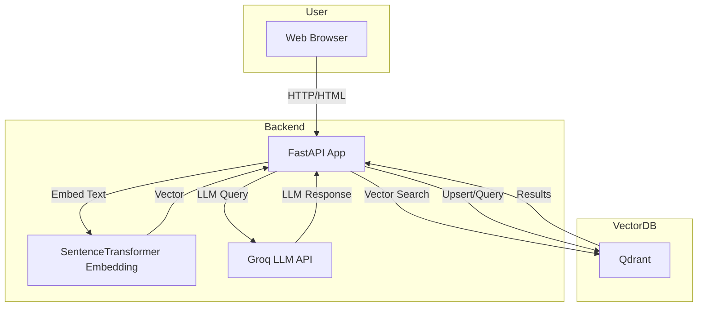
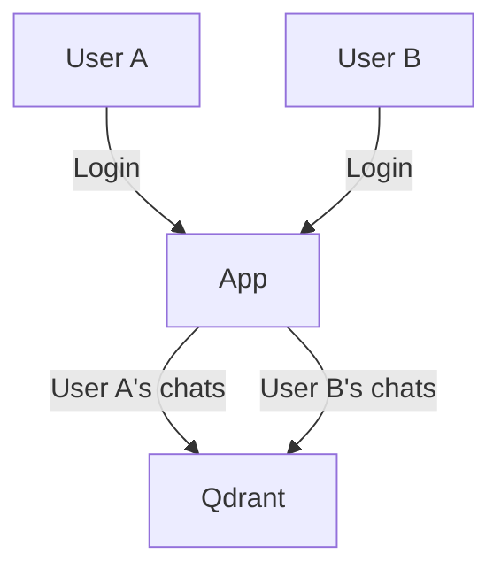
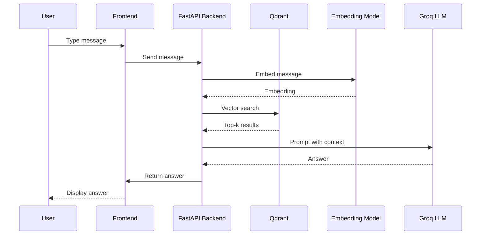
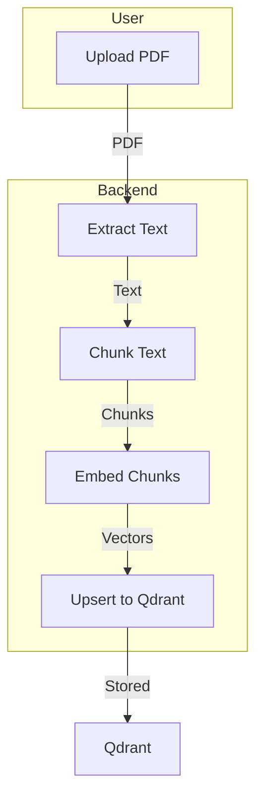

# Project Architecture

## Overview
This project is a modern semantic search and chat web application using Qdrant (vector database), Groq LLM, and FastAPI. It supports text, category, and PDF upload with vectorization, interactive chat with context-grounded answers, and chat history management.
---

## System Architecture



---

## Key Features & Implementation Suggestions

### 1. **Streaming Responses**
- **How:** Use WebSockets or Server-Sent Events (SSE) in FastAPI. The backend streams the LLM response token by token to the frontend, which displays it live.
- **Mermaid:**
```mermaid
graph LR
    User-->|WebSocket/SSE|FastAPI
    FastAPI-->|LLM API (streaming)|Groq
    FastAPI-->|Streamed tokens|User
```

### 2. **Markdown Support**
- **How:** Use a markdown renderer (e.g., [markdown-it](https://github.com/markdown-it/markdown-it) in JS or Python-Markdown in Jinja2) to render bot answers.

### 3. **Rich Chat Bubbles**
- **How:** Update chat.html to include avatars, timestamps, and color-coded bubbles for user/bot. Use CSS for styling.

### 4. **File Upload in Chat**
- **How:** Extend the chat form to accept file uploads. On upload, extract and embed content, then add to the vector DB and reference in chat.

### 5. **Longer Context Window**
- **How:** When building the LLM prompt, include more previous chat turns and/or retrieved documents, up to the model’s token limit.

### 6. **Summarize Long Histories**
- **How:** Use the LLM to summarize older chat history and include the summary in the context prompt.

### 7. **Personalization**
- **How:** Store user preferences (e.g., name, favorite topics) in a user profile (in DB or session) and use them in prompts.

### 8. **Citations**
- **How:** When building the context, keep track of which document each chunk comes from. In the bot’s answer, add superscript links or a reference section.

### 9. **Refusal Policy**
- **How:** Use a system prompt: “If you don’t know, say you don’t know.” Optionally, add logic to detect hallucinations and refuse to answer.

### 10. **Clarification Prompts**
- **How:** If the LLM is unsure (e.g., low confidence or “I don’t know”), prompt the user for clarification.

### 11. **User Login & Multi-user**
- **How:** Add authentication (e.g., FastAPI Users). Store chat history per user.
- **Mermaid:**


### 12. **Session Management**
- **How:** Let users name, delete, or export chat sessions. Add endpoints and UI for these actions.

### 13. **Async Embedding**
- **How:** Use FastAPI BackgroundTasks or Celery to embed and upsert documents asynchronously, especially for large uploads.

### 14. **Rate Limiting**
- **How:** Add middleware or decorators to limit requests per user/IP.

### 15. **Feedback Buttons**
- **How:** Add 👍/👎 buttons to each bot answer. Store feedback in Qdrant or a relational DB.

### 16. **Usage Analytics**
- **How:** Log searches, chats, and feedback. Display stats in an admin dashboard.

### 17. **Admin Dashboard**
- **How:** Build a new page for admins to view all chats, search logs, and manage collections.

### 18. **Export Chat**
- **How:** Add endpoints to download chat history as PDF, CSV, or JSON.

---

## **Chat Flow (with RAG)**


---

## **Data Flow for PDF Upload**


---

## **Extending the System**
- All features are modular and can be added incrementally.
- Use FastAPI’s dependency injection and routers for clean code.
- Use Qdrant for all vector storage and search; add a relational DB for user/auth/session management if needed.

---

## **Summary**
This architecture supports a robust, extensible, and modern semantic search and chat system, ready for advanced features and production deployment. 