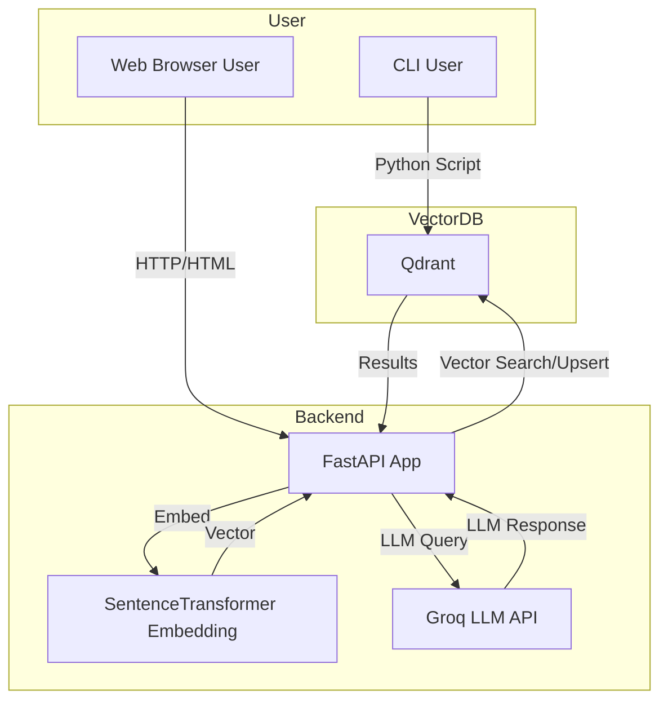
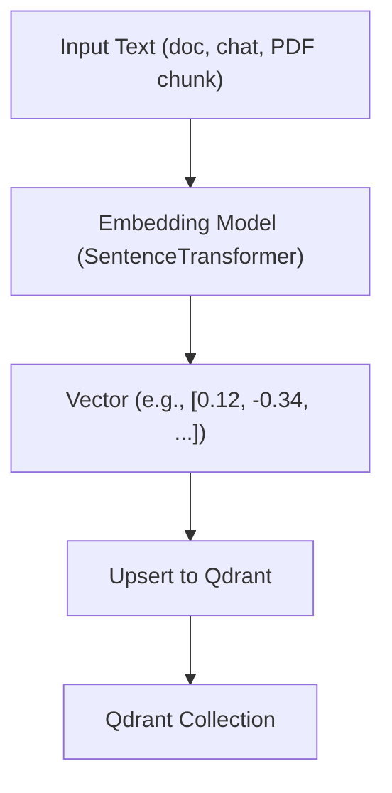
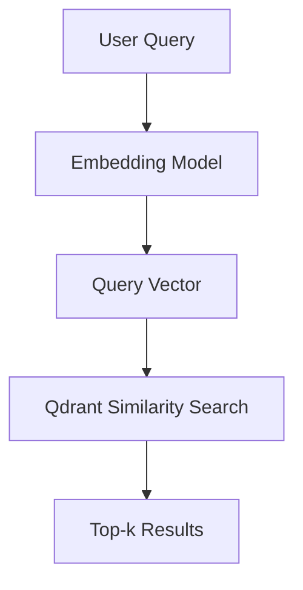
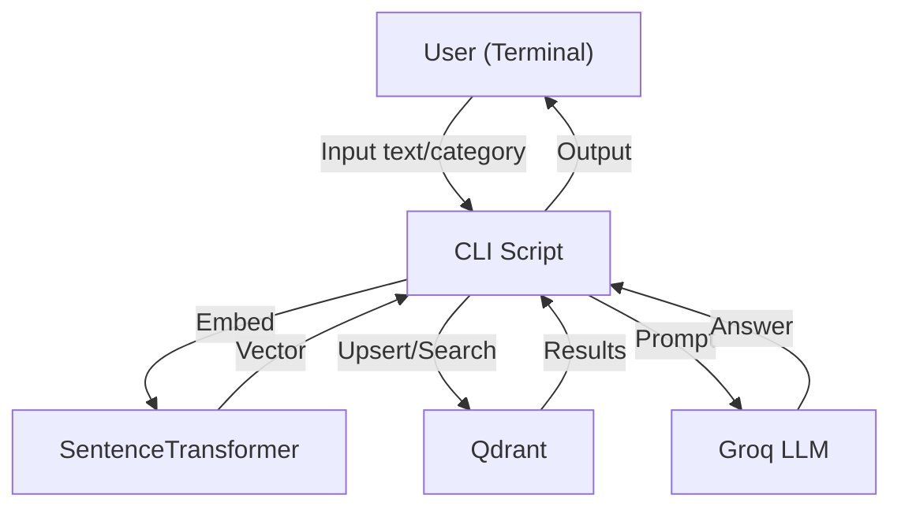
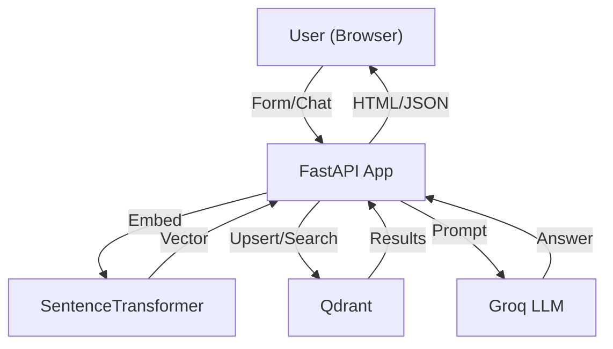
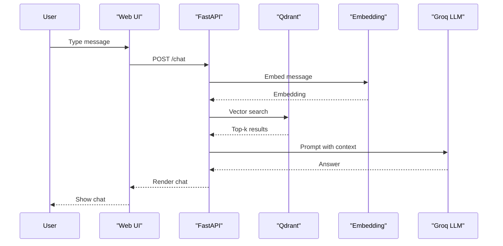
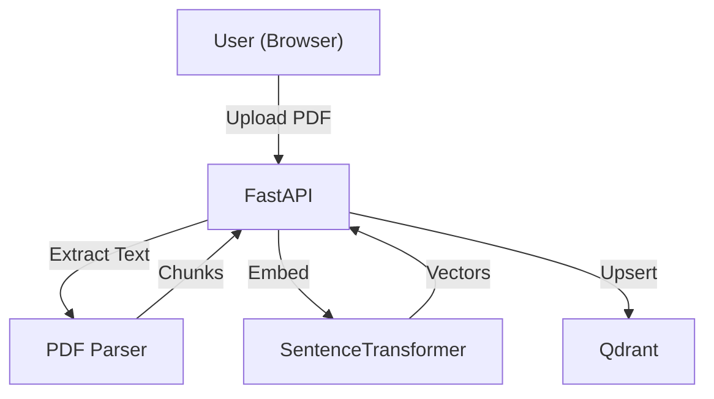

# Architecture: CLI vs Web UI

This document explains how the semantic search and chat system works in both the **CLI** and **Web UI** modes, with architectural diagrams and flow explanations for each.

---

## 1. High-Level System Overview

---

## 2. Vector Creation & Storage Flow

### **How Vectors Are Created and Stored**
- **Text** (from user, document, or PDF chunk) is passed to the embedding model.
- The model outputs a **dense vector** (e.g., 384-dim float array for BAAI/bge-small-en-v1.5).
- The vector, along with metadata, is upserted into Qdrant.

- **Type of Vectors:** Dense, floating-point arrays (e.g., 384-dim for BAAI/bge-small-en-v1.5)
- **Stored with:** Metadata (text, category, source, etc.)

---

## 3. Query/Search Flow & Similarity Algorithm

### **How Query Search Works**
- User query is embedded into a vector.
- Qdrant performs a similarity search against stored vectors.
- The top-k most similar vectors (documents) are returned.

### **Similarity Search Method**
- **Algorithm:** Cosine similarity (default for BAAI/bge-small-en-v1.5)
- **How it works:**
  - Measures the cosine of the angle between the query vector and each stored vector.
  - Returns the vectors/documents with the highest cosine similarity (most similar in meaning).
- **Other options:** Qdrant also supports Euclidean (L2) and Dot Product, but this project uses **Cosine**.

#### **Cosine Similarity Formula:**

\[
\text{cosine}(A, B) = \frac{A \cdot B}{\|A\| \|B\|}
\]

---

## 4. CLI Mode: How It Works

### **Main CLI Scripts:**
- `index_qdrant.py`: For creating collections and adding documents interactively.
- `index.py`: For searching and querying the vector database and LLM from the terminal.

### **CLI Data Flow**

### **Implementation Details**
- **Indexing:**
  - User enters collection name, text, and category.
  - Script checks/creates collection, embeds text, and upserts to Qdrant.
- **Searching:**
  - User enters a query.
  - Script embeds query, searches Qdrant, prints results.
  - Optionally, sends context to Groq LLM for an answer.
- **No persistent chat history** (unless implemented in Qdrant as a collection).

---

## 5. Web UI Mode: How It Works

### **Main Features:**
- Search (semantic search + LLM answer)
- Interactive Chat (with context from vector DB)
- PDF Upload (auto-chunk, embed, index)
- Collection/document management
- Chat history (stored in Qdrant)

### **Web UI Data Flow**

### **Web UI Chat Flow**

### **PDF Upload Flow**

### **Implementation Details**
- **Search:**
  - User selects collection, enters query.
  - Backend embeds query, searches Qdrant, shows results and LLM answer.
- **Chat:**
  - Each message triggers vector search and LLM answer (RAG).
  - Chat history is stored in a `chat_history` collection in Qdrant, grouped by session ID.
  - User can view and continue past chat sessions.
- **PDF Upload:**
  - User uploads PDF, backend extracts and chunks text, embeds, and upserts to Qdrant.
- **Collection/Document Management:**
  - Create collections, add documents, all via web forms.
- **Chat History:**
  - All chat turns are stored in Qdrant with session ID, timestamp, and context.

---

## 6. Key Differences: CLI vs Web UI

| Feature         | CLI Scripts         | Web UI (FastAPI)         |
|----------------|---------------------|--------------------------|
| User Interface | Terminal            | Modern Web Browser       |
| Search         | Yes                 | Yes                      |
| Chat           | Basic (if coded)    | Full, interactive, RAG   |
| PDF Upload     | No                  | Yes                      |
| History        | No (unless coded)   | Yes (Qdrant collection)  |
| Multi-user     | No                  | Possible (add auth)      |
| Admin/Export   | No                  | Possible (add features)  |

---

## 7. Extensibility
- Both modes use the same Qdrant and embedding infrastructure.
- The web UI adds advanced features and is ready for further extension (see ARCHITECTURE.md).
- You can add more CLI tools or web endpoints as needed.

---

## 8. Summary
- **CLI** is great for quick scripts, testing, and admin tasks.
- **Web UI** is user-friendly, feature-rich, and ready for production and team use.
- Both share the same core vector search and LLM logic, ensuring consistency and extensibility. 